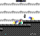

# Castlevania: The Adventure (GB) - AI Gym


This repository contains a Gym environment based on *Castlevania: The Adventure* for Game Boy, using the [PyBoy](https://github.com/Baekalfen/PyBoy) emulator. Its goal is to provide a platform for training artificial intelligence agents in a classic video game environment.



## Installation
```bash
pip install -r requirements.txt
```

To install the required PyBoy version with the specific game wrapper, clone and install from the following branch:
```bash
git clone --branch CastlevaniaTheAdventure-Wrapper https://github.com/BackrndSource/PyBoy.git
cd PyBoy
pip install .
```

## Custom Environment
The Castlevania environment (`CastlevaniaPyBoyEnv`) extends a custom class, `PyBoyEnv`. This class can be reused for other games within the PyBoy emulator and is located in `environments/PyBoyEnv.py`.

## Usage
To train an agent, run:
```bash
python train.py
```

To test a trained agent, run:
```bash
python enjoy.py
```

## Memory scan UI
A UI is also included to analyze memory using PyBoy's memscan. To use it, run:
```bash
python run.py
```

## ROM Requirement
You need to add the game ROM named *Castlevania - The Adventure (Europe).gb* in the root directory of the project.

## Model Checkpoints
Trained model checkpoints can be found in the `models` directory.

## Tensorboard
```bash
tensorboard --logdir tensorlogs
```